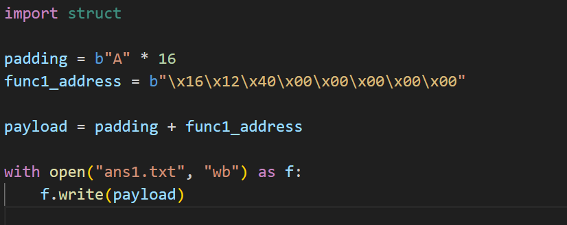
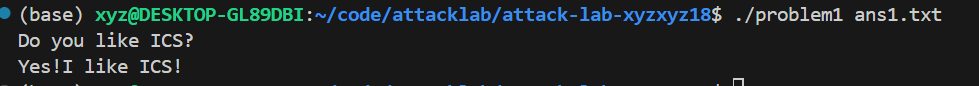
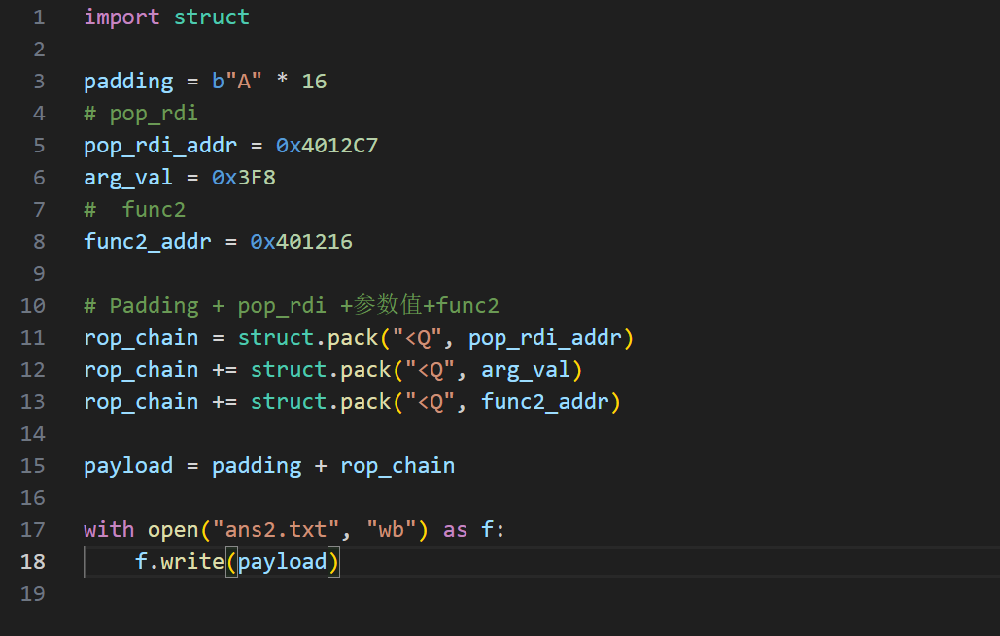
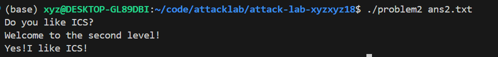
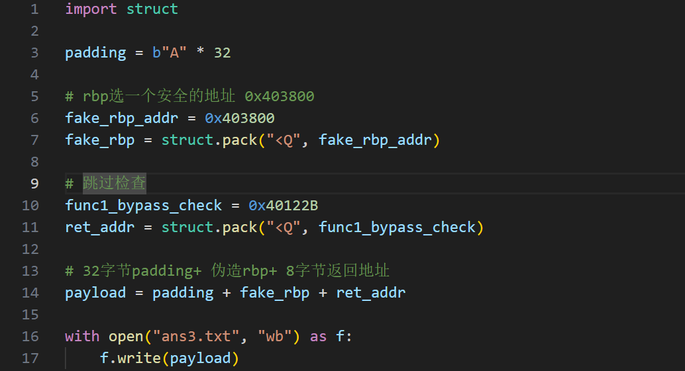
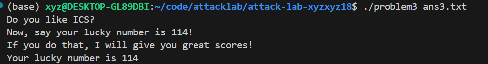
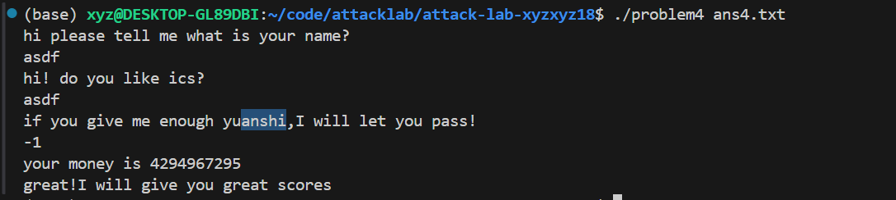

# 栈溢出攻击实验

## 题目解决思路

### Problem 1: 
- **分析**：
1.在func函数中(0x401232):  
    401246: lea    -0x8(%rbp),%rax  
2.Buffer（8字节）+saved rbp（8字节）=16字节  
3.程序将输入复制到了栈上 rbp-0x8 的位置,所以填充的数据长度16 字节，之后跳转到目标函数即可  
- **解决方案**：
- 
- **结果**：
- 

### Problem 2:
- **分析**：
func2需要0x3f8，才能成功跳转，且是第一个参数，所以要让%rdi中为ox3f8，可以用pop_rdi  
1.Padding: 16字节,覆盖buffer和rbp  
2.跳转到 pop rdi,修改rdi中的值，return  
3.跳转到func2，通过  
- **解决方案**：
- 
- **结果**：
- 

### Problem 3: 
- **分析**：
1.在func函数中：padding为32字节  
2.func1 正常调用需要参数 0x72，但缺乏修改 %rdi 函数。所以直接跳转到 func1 检查指令之后的地址 (0x40122b)，跳过 cmp  
3.寻找安全的rbp位置，如 0x403800  
4.添加返回地址，跳过 cmp  
- **解决方案**：
- 
- **结果**：
- 

### Problem 4: 
  - **分析**：体现canary的保护机制是什么  
开启了栈保护  
136c: mov    %fs:0x28,%rax     （获取随机生成的Canary）  
1375: mov    %rax,-0x8(%rbp)  
在返回前进行比较是否被修改，来验证栈结构是否遭到破坏  
  - **解决方案**：
因为最后比较是：无符号数是否>= 0xfffffffe  
所以-1代表的0xffffffff可以成立通过  
- **结果**：

## 思考与总结
前三题层层递进，包含了涵盖栈溢出、其他函数工具调用、伪造rbp  
简单到难，有工具到自己构造工具，难度曲线合适  

最后一题涉及绕过Canary

## 参考资料

列出在准备报告过程中参考的所有文献、网站或其他资源，确保引用格式正确。
